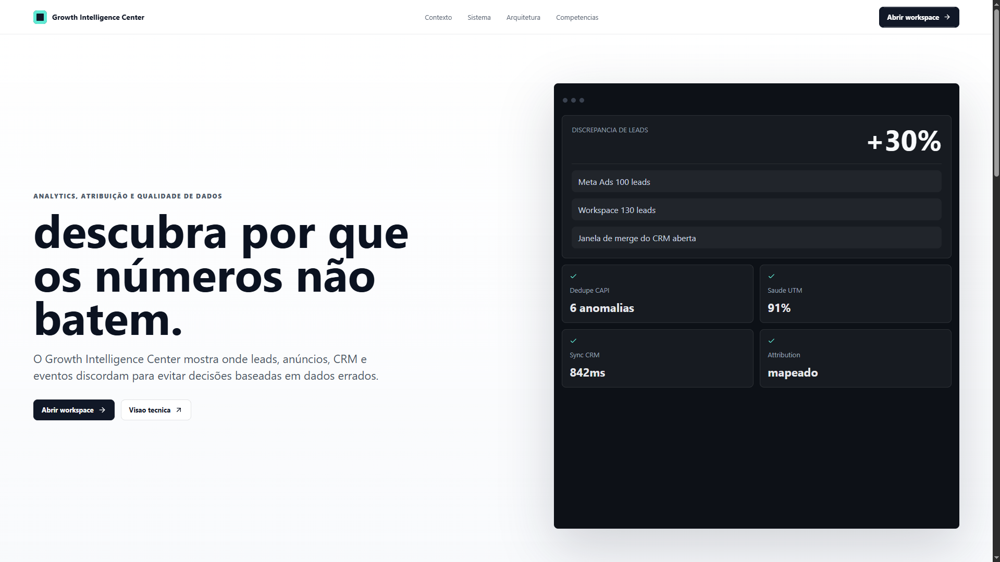
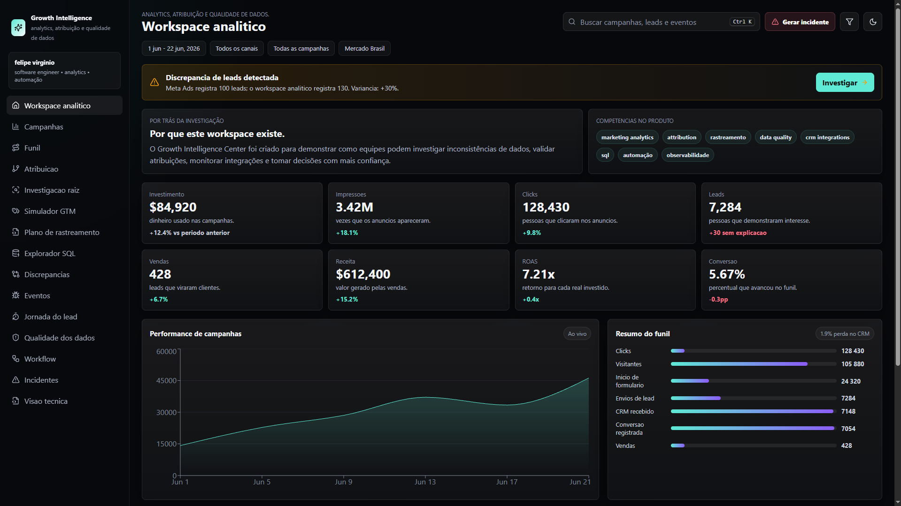
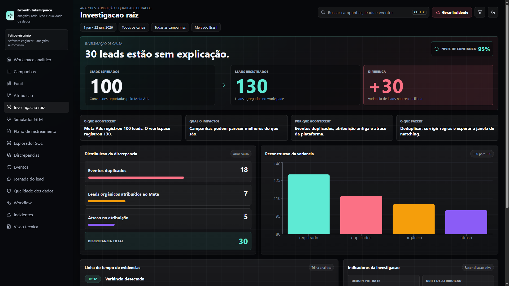
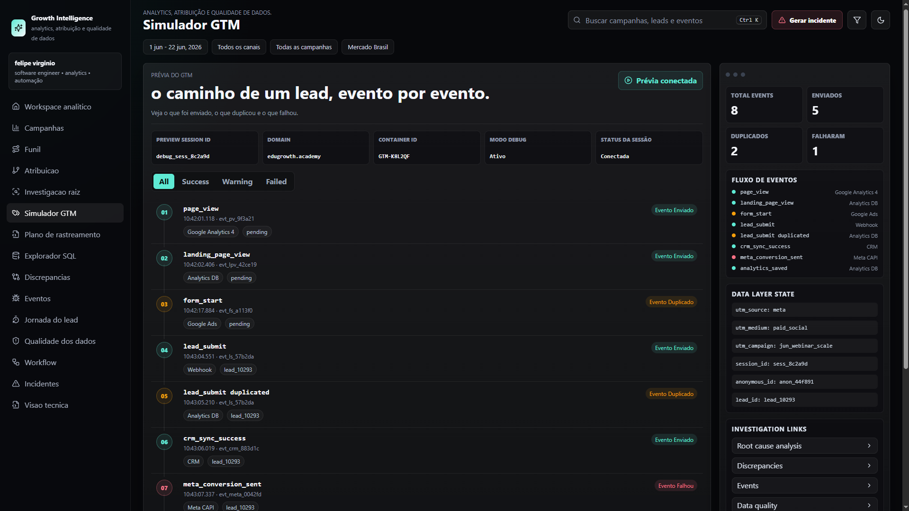
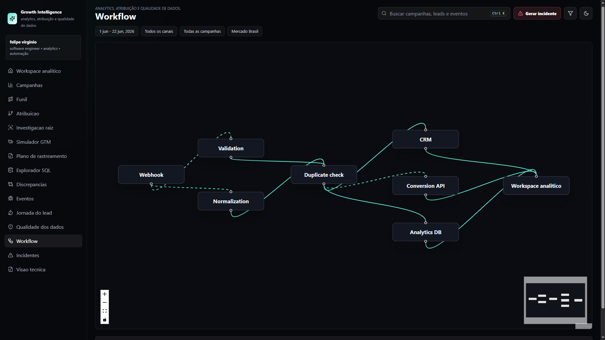
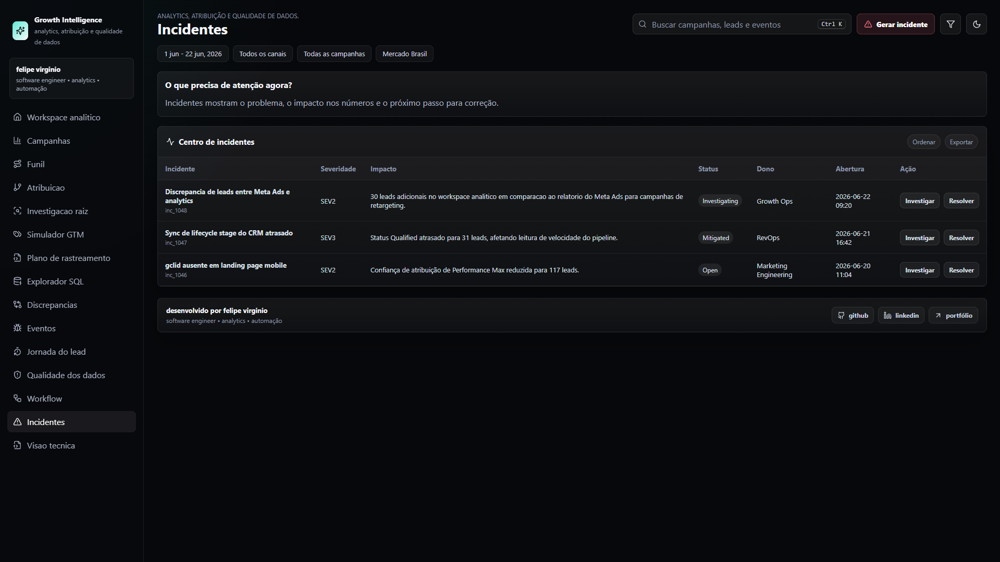

# Growth Intelligence Center

Plataforma web que simula uma operação real de marketing analytics, rastreamento de conversões, integração com CRM, qualidade dos dados e investigação de discrepâncias.

O objetivo do projeto é mostrar como números que não batem podem ser investigados antes de gerarem decisões erradas.

Este repositório **não representa um sistema real em produção**. É uma simulação técnica realista criada para demonstrar habilidades em analytics, rastreamento, qualidade de dados, automação, investigação de discrepâncias e engenharia de software.

## Deploy

https://growth-intelligence-center-pink.vercel.app/

## Screenshots

### 1. Landing page

Apresenta o problema central do produto: descobrir por que os números não batem.



### 2. Workspace analítico

Visão geral com métricas, funil, alertas e discrepância entre Meta Ads e workspace.



### 3. Investigação raiz

Análise da diferença entre 100 leads esperados e 130 leads registrados, separando eventos duplicados, atribuição incorreta e atraso de sincronização.



### 4. Simulador GTM

Simulação inspirada no Google Tag Manager Preview / Tag Assistant para acompanhar eventos enviados, duplicados e falhos.



### 5. Workflow

Fluxo visual simulando webhook, validação, normalização, deduplicação, CRM, Conversion API e Analytics DB.



### 6. Centro de incidentes

Central para visualizar incidentes, impactos, severidade, responsáveis e ações de investigação.



## Problema Que O Projeto Resolve

Em operações de crescimento, é comum que plataformas de mídia, CRM, eventos de tracking e dashboards internos contem histórias diferentes sobre o mesmo funil.

O Growth Intelligence Center simula esse tipo de cenário e mostra uma forma estruturada de investigar:

* por que uma fonte registra mais leads que outra;
* quais eventos podem estar duplicados;
* onde a atribuição pode ter sido contaminada;
* quais integrações podem ter atrasado ou falhado;
* qual impacto uma divergência pode gerar na leitura do negócio.

A proposta não é vender uma ferramenta pronta, mas demonstrar raciocínio técnico e de produto aplicado a um problema real de analytics.

## Cenário Simulado

O contexto fictício usado no projeto é a **EduGrowth Academy**, uma operação de educação com campanhas pagas, landing page, formulário, CRM, Conversion API, banco analítico e workspace operacional.

O fluxo simulado conecta:

* campanhas de Meta Ads e Google Ads;
* captura de leads em landing page;
* envio de eventos por webhook;
* validação e normalização de payloads;
* deduplicação;
* atualização de CRM;
* envio para Conversion API;
* consolidação em Analytics DB;
* investigação no workspace.

Esse cenário foi desenhado para parecer realista o suficiente para sustentar uma investigação técnica, sem depender de dados sensíveis ou de integrações reais de produção.

## Caso Principal: 100 Leads Vs 130 Leads

O caso central do produto é uma discrepância entre fontes:

* **Meta Ads:** 100 leads
* **Workspace:** 130 leads

A investigação reconstrói essa diferença e separa os principais fatores que explicam o desvio:

* eventos duplicados no tracking;
* leads orgânicos herdando atribuição paga;
* atraso de sincronização entre plataforma, CRM e analytics;
* eventos aceitos no workspace, mas rejeitados ou atrasados em outros destinos.

A narrativa do produto mostra como sair de uma pergunta simples, "por que os números não batem?", para uma análise acionável de causa, impacto e correção.

## Funcionalidades Principais

* **Workspace analítico:** visão consolidada de métricas, funil, alertas e discrepâncias.
* **Investigação de causa raiz:** decomposição da diferença entre fontes e explicação dos principais desvios.
* **Simulador GTM:** leitura visual de eventos enviados, duplicados, falhos e seus destinos.
* **Workflow de dados:** representação do caminho entre webhook, validação, CRM, Conversion API e banco analítico.
* **Centro de incidentes:** acompanhamento de severidade, impacto, responsáveis e ações de investigação.
* **Tracking plan:** documentação dos eventos, gatilhos, parâmetros esperados e destinos.
* **Data Quality Center:** simulação de inconsistências como UTMs ausentes, emails inválidos, duplicidades e falhas de conversão.
* **SQL Explorer:** área read-only para demonstrar raciocínio analítico sobre campanhas, atribuição, qualidade e incidentes.

## Arquitetura Do Fluxo De Dados

O fluxo principal do projeto segue esta sequência:

```text
Ads
  -> Landing page
  -> Formulário
  -> Webhook
  -> Validação
  -> Normalização
  -> Deduplicação
  -> CRM
  -> Conversion API
  -> Analytics DB
  -> Workspace
```

Em termos práticos:

1. O anúncio gera o clique.
2. A landing page recebe a visita.
3. O formulário registra o lead.
4. O webhook envia o evento.
5. A camada de validação verifica consistência mínima.
6. A normalização padroniza campos e parâmetros.
7. A deduplicação reduz contagens infladas.
8. O CRM recebe ou atualiza o contato.
9. A Conversion API replica sinais para plataformas de mídia.
10. O Analytics DB consolida a leitura.
11. O workspace apresenta métricas, alertas e investigação.

## Stack

* React 18
* TypeScript
* Vite
* Recharts
* React Flow
* Lucide React

## Como Rodar Localmente

Instale as dependências:

```bash
npm install
```

Inicie o ambiente local:

```bash
npm run dev
```

Gere o build de produção:

```bash
npm run build
```

## Próximos Passos

Possíveis evoluções para o projeto:

* ampliar os cenários de discrepância;
* detalhar validações de tracking por destino;
* enriquecer o catálogo de incidentes simulados;
* adicionar mais consultas analíticas ao SQL Explorer;
* simular políticas de governança para eventos críticos;
* criar variações de investigação por canal, campanha e origem.

## Autor

**felipe virginio**  
software engineer • analytics • automação

Links oficiais:

* GitHub: https://github.com/fezleep
* LinkedIn: https://www.linkedin.com/in/fezleep/
* Portfólio: https://portfolio-dev-alpha-eight.vercel.app/
